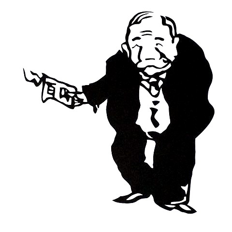

## jissen_nihongo_II- 実践日本語

### Modern Japanese History in Political Cartoons - 風刺画から見た日本近代史

#### Course objectives:

A central characteristic of modernity and modern society is the way in which it is both a) created and b) recreated by communication technologies. Gutenberg's printing press in particular was the catalyst that boosted the production of information to a degree the world had not seen before. It also heralded a revolution. As argued by [Elizabeth Eisenstein](https://en.wikipedia.org/wiki/Elizabeth_Eisenstein) and others, the printing press defined newly developing social domains. Through the ways in which it combined the *dissemination*, *standardization* and *preservation* of information, it has, for instance, abetted 'modern' scientific communication and the the notion of falsification, which is crucial to the latter.

Importantly, Gutenberg's invention also empowered dissent. The element of dissemination allowed the manufacture and distribution of incriminating, subversive, or libelous information, which plays a role in the formation [public opinion](https://doi.org/10.1093/acrefore/9780190228637.013.), the fuel of the modern political system. 

In this course, we trace the role of the printing press in the creation of a particular space of Japanese public opinion: the political cartoon. We will study how foreign examples as [Le Charivari](https://en.wikipedia.org/wiki/Le_Charivari), [Punch](https://en.wikipedia.org/wiki/Punch_(magazine)) and the German [Kladderadatsch](https://www.ub.uni-heidelberg.de/helios/digi/kladderadatsch.html) and [Simplicissimus](https://en.wikipedia.org/wiki/Simplicissimus) became examples for Japanese satirical publications as Marumaru Chinbun [團團珍聞](https://ja.wikipedia.org/wiki/%E5%9C%98%E5%9C%98%E7%8F%8D%E8%81%9E), Jiji Manga 時事漫画, Tokyo Puck 東京パック and others; and we demonstrate how the visual medium could be hijacked to fit the agenda of autocratic governments.

#### Course Goals

We will read and translate a recently published Japanese book on the modern Japanese political cartoon.

#### Course Material

清水勲. 2015. 『風刺画で読み解く近代史』. 三笠書房.

#### Topics to be covered:

1. **Introductory session: Duus, Peter. 2001. “Presidential Address: Weapons of the Weak, Weapons of the Strong—The Development of the Japanese Political Cartoon.” The *Journal of Asian Studies* 60 (4): 965–97. https://doi.org/10.2307/2700017.**

This course discusses chapters from the book 『風刺画で読み解く近代史』:

* １章　幕末から明治１０年代まで（開国—日本、植民地化の危機！；戊辰戦争—西欧のにらみ合い　ほか）
* ２章　明治２０年代（日清戦争—傑作風刺画が生まれた背景；レストラン—最先端西洋料理店の細密描写　ほか）
* ３章　明治３０年代（列強クラブ—新入りに好奇の眼；金本位制—「金さん」が輝いた時代　ほか）
* ４章　明治４０年代・大正時代（軍国主義時代の主役は誰？；伊藤博文—死者にムチ打つ風刺画　ほか）
* ５章　昭和初期から第二次世界大戦まで（一枚に凝縮された、昭和初期の不況社会；低賃金を武器とするダンピング批判　ほか）

#### Related Reading

* Briggs, Jo. 2016. “‘The Gutta Percha Staff’: Between Respectable and Risqué Satire in 1848.” *Novelty Fair*, March. https://www.manchesterhive.com/view/9781784997038/9781784997038.00009.xml.
* Cayley, Seth, and Clare Horrocks. 2015. “The Punch Historical Archive, 1841–1992: A Sustainable Brand for the Digital Age.” *Victorian Periodicals Review* 48 (2): 238–43. https://doi.org/10.1353/vpr.2015.0024.
* Culbertson, Tom. 2008. “The Golden Age of American Political Cartoons.” *The Journal of the Gilded Age and Progressive Era* 7 (3): 277–95. https://doi.org/10.1017/S1537781400000724.
* Cuno, James. 1983. “Charles Philipon, La Maison Aubert, and the Business of Caricature in Paris, 1829–41.” *Art Journal* 43 (4): 347–54. https://doi.org/10.1080/00043249.1983.10792253.
* Harder, Hans. 2013. “Prologue: Late Nineteenth and Twentieth Century Asian Punch Versions and Related Satirical Journals.” In *Asian Punches: A Transcultural Affair*, edited by Hans Harder and Barbara Mittler, 1–11. Transcultural Research – Heidelberg Studies on Asia and Europe in a Global Context. Berlin, Heidelberg: Springer Berlin Heidelberg. https://doi.org/10.1007/978-3-642-28607-0_1.
* Higgie, Rebecca. 2017. “Under the Guise of Humour and Critique: The Political Co-Option of Popular Contemporary Satire.” In *Satire and Politics: The Interplay of Heritage and Practice*, edited by Jessica Milner Davis, 73–102. Palgrave Studies in Comedy. Cham: Springer International Publishing. https://doi.org/10.1007/978-3-319-56774-7_3.
* Hotwagner, Sonja. 2013. “‘Punch’s Heirs’ Between the (Battle) Lines: Satirical Journalism in the Age of the Russo-Japanese War of 1904–1905.” In *Asian Punches: A Transcultural Affair*, edited by Hans Harder and Barbara Mittler, 337–64. Transcultural Research – Heidelberg Studies on Asia and Europe in a Global Context. Berlin, Heidelberg: Springer Berlin Heidelberg. https://doi.org/10.1007/978-3-642-28607-0_14.
* Kunzle, David. 1983. “Between Broadsheet Caricature and ‘Punch’: Cheap Newspaper Cuts for the Lower Classes in the 1830s.” *Art Journal* 43 (4): 339–46. https://doi.org/10.1080/00043249.1983.10792252.
* Palmeri, Frank. 2004. “Cruikshank, Thackeray, and the Victorian Eclipse of Satire.” *Studies in English Literature, 1500-1900* 44 (4): 753–77. https://www.jstor.org/stable/3844535.
* Rea, Christopher G. 2013. “‘He’Ll Roast All Subjects That May Need the Roasting’: Puck and Mr Punch in Nineteenth-Century China.” In *Asian Punches: A Transcultural Affair*, edited by Hans Harder and Barbara Mittler, 389–422. Transcultural Research – Heidelberg Studies on Asia and Europe in a Global Context. Berlin, Heidelberg: Springer Berlin Heidelberg. https://doi.org/10.1007/978-3-642-28607-0_16.
* Spielmann, Marion Harry. 1895. *The History of Punch*. Gale Research Company.
* Wechsler, Judith. 1983. “Editor’s Statement: The Issue of Caricature.” *Art Journal* 43 (4): 317–18. https://doi.org/10.1080/00043249.1983.10792248.
* Wu, I-Wei. 2013. “Participating in Global Affairs: The Chinese Cartoon Monthly Shanghai Puck.” In *Asian Punches: A Transcultural Affair*, edited by Hans Harder and Barbara Mittler, 365–87. Transcultural Research – Heidelberg Studies on Asia and Europe in a Global Context. Berlin, Heidelberg: Springer Berlin Heidelberg. https://doi.org/10.1007/978-3-642-28607-0_15.
* 湯本豪一. 2011. 『風刺漫画で日本近代史がわかる本』. Tōkyō: 草思社.

#### Homework

From session 2 onwards, students (or small student groups) will be assigned to introduce chapters of 『風刺画で読み解く近代史』 to be discussed. This may include both historical matter and/or their contemporary implications.

*All* students are expected to:

1. participate in the course as a whole: doing the essential reading for each week’s topic, and coming prepared to question and intervene.
2. provide written and oral comments;
3. research, write, present, and defend your argument and choice of topic to be discussed.
4. When presenting, students should go beyond the narrow content of the reading to be presented; develop an argument as a coherent whole, e.g. by focusing on theoretical issues, methodological ones, and so on.

#### How to read?

Undergraduate students often find it challenging to read scientific articles; and indeed, the format that characterizes scientific publications is quite different from what may have been familiar in highschool. [Here](https://en.wikipedia.org/wiki/SQ3R) is a digest of a comprehensive reading method called SQ3R; there also exists a [longer guide](https://www.ucc.vt.edu/academic_support/online_study_skills_workshops/SQ3R_improving_reading_comprehension.html). 

#### Grading System

As this course (just as my other courses) [does not believe in the usefulness of final grades](https://www.youtube.com/watch?v=KShfEMy8UZQ), evaluation will be based on: reading notes, class discussions (other means of evaluation may be discussed with the students), and so in. There is no paper to be written; instead, students are asked to _prepare fluent translations of chapters to be discussed_. They are responsible for putting the presented reading in context, and act as ‘moderator’ for the follow-up discussion.
Although all grading is characterized by an inherent opacity (if only for the simple reason that every presentation relates to different material and takes place in a different session), here are some simple rules:

1. All students will at least present during one of the sessions
2. students making elaborate presentations (including audiovisual material, links to primary sources etc.) will be rewarded for the extra effort
3. showing that you mastered the readings by partaking actively in the discussions is a plus.

As this class is an example of [problem-based learning](https://en.wikipedia.org/wiki/Problem-based_learning) and the ['flipped classroom'](https://en.wikipedia.org/wiki/Flipped_classroom), it **strongly encourages and rewards participation**; vice versa, **it penalizes a passive or absent behavior**. Concretely, 80 percent of your grade is based on class discussion; the remaining 20 percent is reserved for presentations.

**Some rules: whereas attendance is considered crucial, merely being present in class is insufficient to pass. Active participation is prerequisite. Checking social media or constantly looking at your phone during class is discouraging and even disturbing for your peers, so should be avoided. This class demands a considerable degree of commitment; do not take this class if you are not motivated.**
